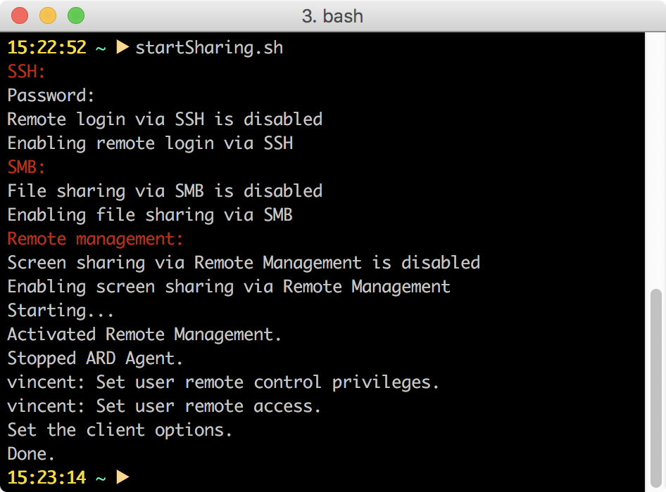

This shell script let's you toggle between enabling and disabling SSH, Samba, and Remote Login (VNC) on OSX via the command line.

The script will ask for root priviliges (sudo).

It has been tested on Mac OSX 10.12.6.

Adter invoking the script it will test if SSH, Samba, and Remote Login are enabled. If this is the case the script will disable them. If these services are disabled, the script will enable them.

Screenshot:

